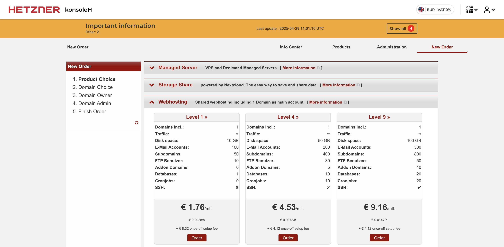
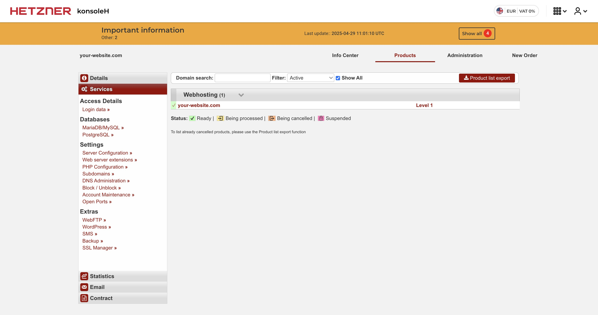
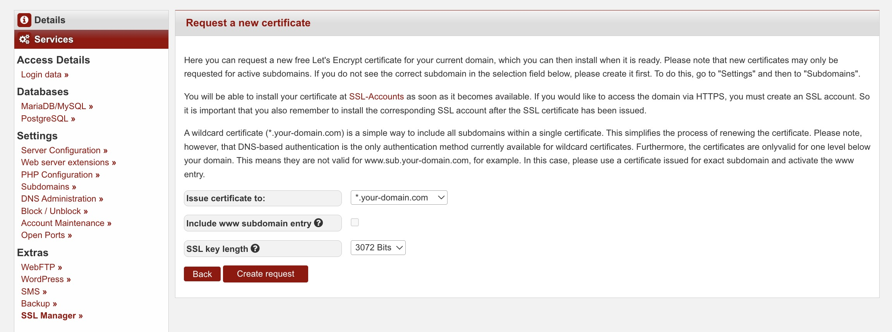
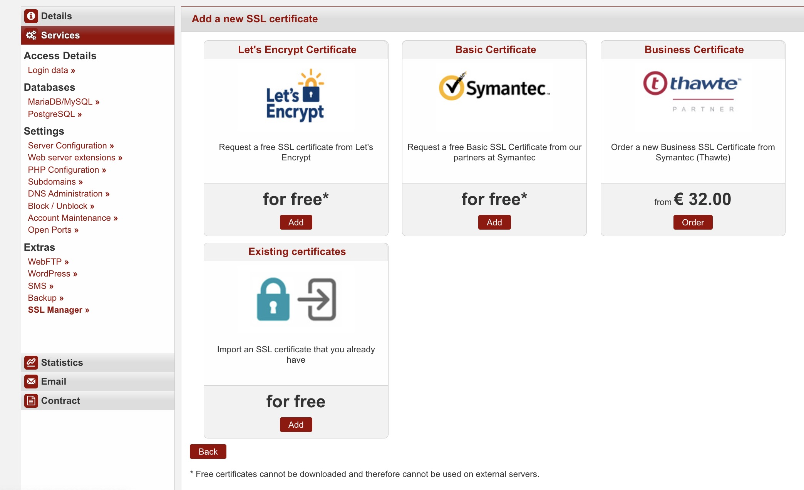
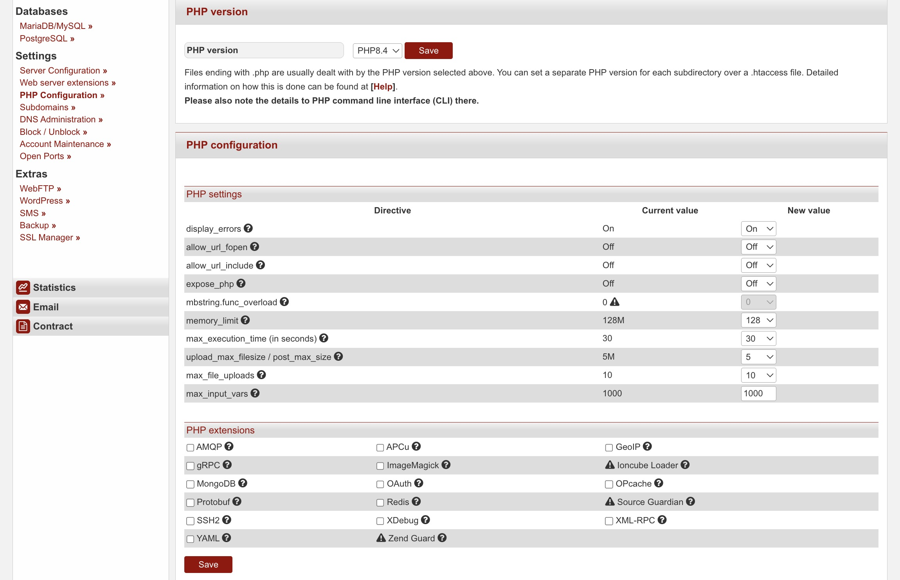
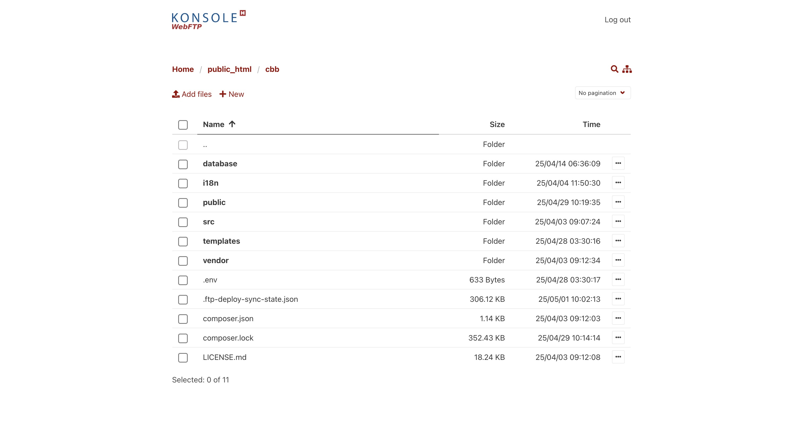
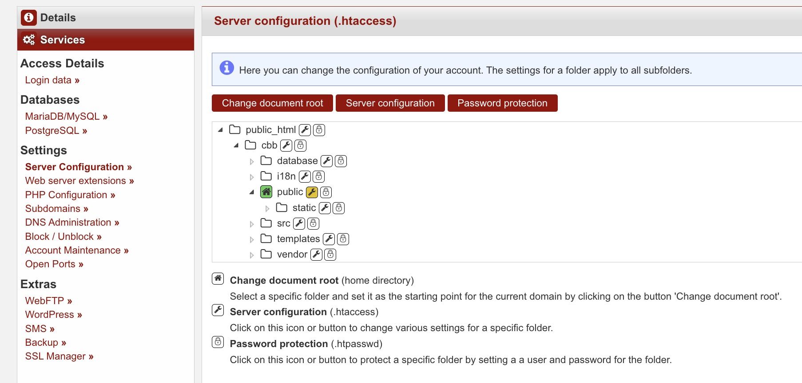
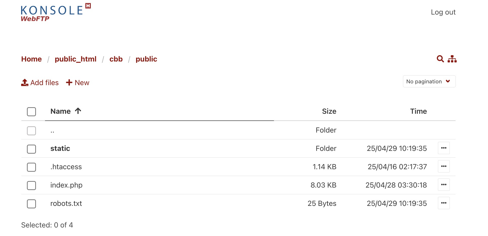
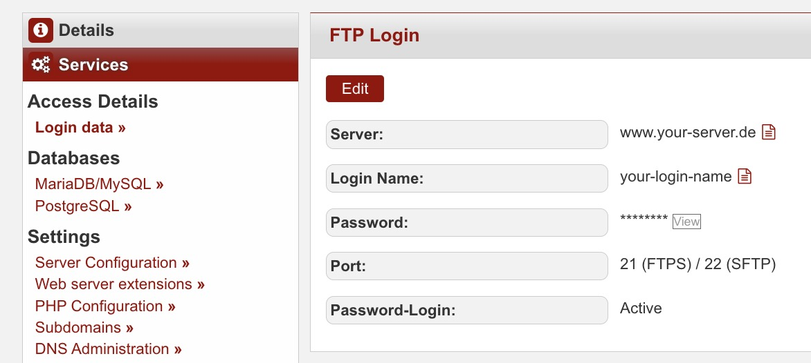

[](https://creativecommons.org/licenses/by-nc/4.0/)

[English](./README.md) | [Română](./README.ro.md)

# Deploying to Hetzner Webhosting

*Estimated time ≈ 30-60 minutes*

The setup to deploy this solution to `Hetzner` implies:

1. Register an account
2. Acquiring a WebHosting level 1 plan
3. Creating a MariaDB database
4. Issuing an SSL certificate
5. Configuring PHP
6. Creating the path for automatic deployments with WebFTP
7. Setting the document root to `public_html/cbb/public`
8. Configuring the Apache .htaccess file
9. Configuring the GitHub secrets and variables
10. Deploying the solution from GitHub

## 1. Register an account

To get started, you'll need to create an account on the Hetzner website.
Visit [Hetzner's sign up page](https://accounts.hetzner.com/signUp) and complete the process.

## 2. Acquiring a WebHosting level 1 plan

1. After logging in to your Hetzner account, navigate to the WebHosting section
2. Select the `Level 1` hosting plan, which is sufficient for running the `Community Bulletin Board`
3. Follow the checkout process, which includes selecting a domain name
4. Complete the payment process



Once your order is processed, you'll receive confirmation and access to your hosting control panel.



## 3. Creating a MariaDB database

1. In your Hetzner control panel, navigate to the "Databases" or "MySQL/MariaDB" section
2. Create a new MariaDB database
3. Make note of the database name, username, password, and host information as you'll need these later for
   configuration

## 4. Issuing an SSL certificate

1. In the Hetzner control panel, navigate to the "SSL" section
2. Click on "Request new certificate" or a similar option

   

3. Select your domain and follow the steps to request a new SSL certificate

   

4. Once the certificate is issued, you can view its details in the SSL section

   

## 5. Configuring PHP

1. In the Hetzner control panel, go to the "PHP Configuration" section
2. Ensure that PHP 8.4 is selected as the version
3. Adjust any other PHP settings as needed for optimal performance,
   although the default ones are just fine

*Note: The required extensions: pdo, openssl, and gettext are installed by default*



## 6. Creating the path for automatic deployments with WebFTP

1. Access the WebFTP interface from your Hetzner control panel.
2. Navigate to the public_html directory, which is your website's root folder.

   

3. Create a new directory named `cbb`
4. Within the `cbb` directory, create a new directory named `public`

The `cbb` directory will be the target for your GitHub Actions deployments.



## 7. Setting the document root to `public_html/cbb/public`

1. In the Hetzner control panel, go to the "Server Configuration" section
2. Click on `public_html/cbb/public`
3. Click on "Change document root"

## 8. Configuring the Apache .htaccess file

1. Go to your "Server Configuration" and you should see the following:

   

2. Press the 🔧(wrench) icon and then "Advanced View"
3. Copy-paste the following:

   ```apacheconf
   RewriteEngine On

   # reroute requests for non-existing files, except those under /static/, to index.php
   RewriteCond %{REQUEST_FILENAME} !-f
   RewriteCond %{REQUEST_URI} !^/static/ [NC]
   RewriteRule ^ index.php [L]
    
   # gzip compression
   <IfModule mod_deflate.c>
     AddOutputFilterByType DEFLATE text/plain
     AddOutputFilterByType DEFLATE text/html
     AddOutputFilterByType DEFLATE text/xml
     AddOutputFilterByType DEFLATE text/css
     AddOutputFilterByType DEFLATE text/javascript
     AddOutputFilterByType DEFLATE application/xml
     AddOutputFilterByType DEFLATE application/xhtml+xml
     AddOutputFilterByType DEFLATE application/rss+xml
     AddOutputFilterByType DEFLATE application/javascript
     AddOutputFilterByType DEFLATE application/x-javascript
   </IfModule>
    
   # cache static files
   <IfModule mod_expires.c>
       ExpiresActive On
       ExpiresByType image/svg+xml "access plus 30 days"
       ExpiresByType text/css "access plus 1 day"
       ExpiresByType text/javascript "access plus 1 day"
       ExpiresByType application/javascript "access plus 1 day"
   </IfModule>
   ```

4. Hit save and reload the page to ensure that it actually saved the changes

You can double-check that the .htaccess file is configured correctly by visiting it in WebFTP:



## 9. Configuring the GitHub secrets and variables

Now comes the fun part: creating all the necessary GitHub secrets and variables.

For the FTP details, go to the "Access Details" in Hetzner:



For email, go to "Email" > "Mailboxes" > "How to set up a mail program":


1. In your GitHub repository, navigate to the "Settings" section
2. Click on "Secrets and variables", and then "Actions"

   

3. You will need to add the following secrets / variables to your repository (ignore `CRYPTO_PEPPER`):

   

4. Once that is done, go to the "Variables" tab and add the following variables:

   

## 10. Deploying the solution from GitHub


1. Go to the "Actions" tab and click on the "CI/CD pipeline" workflow
2. Click on the "Run workflow" dropdown and then on the "Run workflow" button
3. Wait for the workflow to finish and then check if the deployment was successful

I hope this guide worked for you without any issues. If you have any questions or need
further assistance, feel free to open an issue.
