[](https://creativecommons.org/licenses/by-nc/4.0/)

[English](./HETZNER.md) | [Română](./HETZNER.ro.md)

# Deploy pe Hetzner Webhosting

*Timp estimat ≈ 30-60 minute*

Configurarea pentru deploy-ul acestei soluții pe `Hetzner` implică:

1. Înregistrarea unui cont
2. Achiziționarea unui plan WebHosting nivel 1
3. Crearea unei baze de date MariaDB
4. Emiterea unui certificat SSL
5. Configurarea PHP
6. Crearea căii pentru implementări automate cu WebFTP
7. Setarea directorului rădăcină la `public_html/cbb/public`
8. Configurarea fișierului Apache .htaccess
9. Configurarea secretelor și variabilelor GitHub
10. Deploy-ul soluției de pe GitHub

## 1. Înregistrarea unui cont

Pentru a începe, va trebui să creați un cont pe site-ul Hetzner.
Vizitați [pagina de înregistrare Hetzner](https://accounts.hetzner.com/signUp) și completați procesul.

## 2. Achiziționarea unui plan WebHosting nivel 1

1. După autentificarea în contul Hetzner, navigați la secțiunea WebHosting
2. Selectați planul de găzduire `Nivel 1`, care este suficient pentru rularea `Avizierului Comunitar`
3. Urmați procesul de checkout, care include selectarea unui nume de domeniu
4. Finalizați procesul de plată

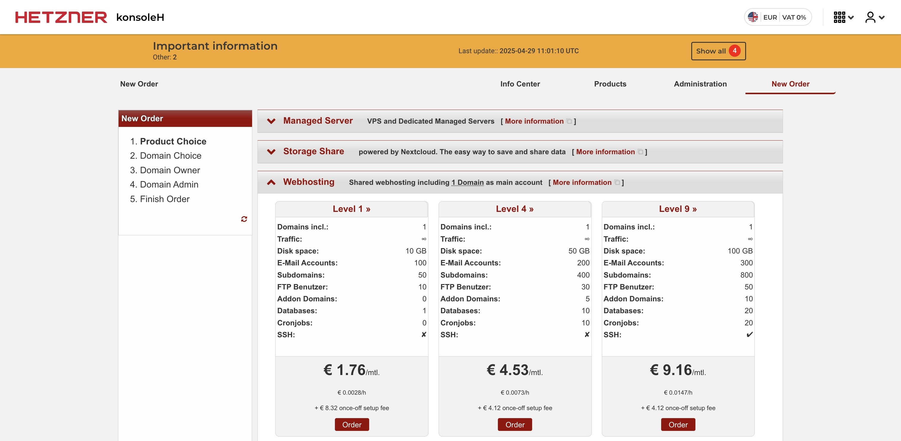

Odată ce comanda dvs. este procesată, veți primi confirmarea și accesul la panoul de control al găzduirii.

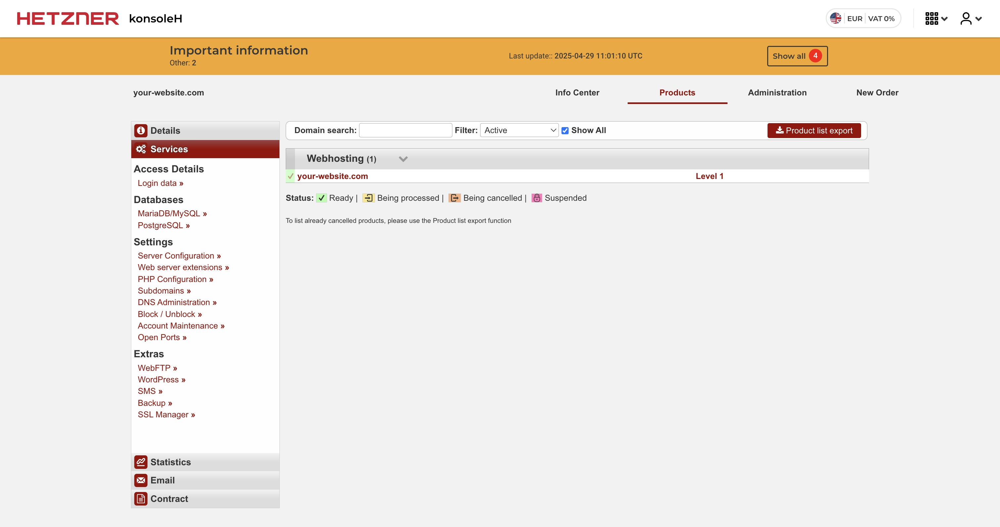

## 3. Crearea unei baze de date MariaDB

1. În panoul de control Hetzner, navigați la secțiunea "Databases" sau "MySQL/MariaDB"
2. Creați o nouă bază de date MariaDB
3. Notați numele bazei de date, numele de utilizator, parola și informațiile despre host, deoarece veți avea nevoie de acestea mai târziu pentru configurare

## 4. Emiterea unui certificat SSL

1. În panoul de control Hetzner, navigați la secțiunea "SSL"
2. Faceți clic pe "Request new certificate" sau o opțiune similară

   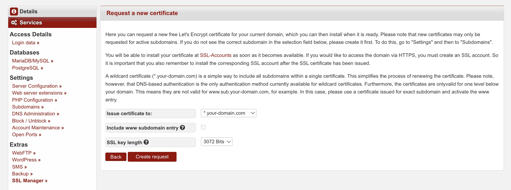

3. Selectați domeniul dvs. și urmați pașii pentru a solicita un nou certificat SSL

   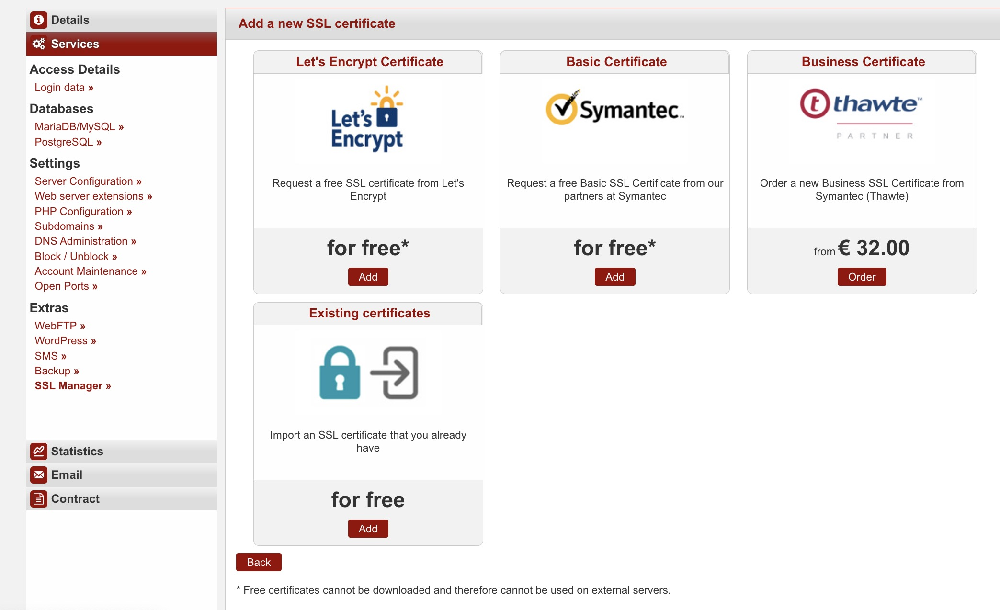

4. Odată ce certificatul este emis, puteți vizualiza detaliile acestuia în secțiunea SSL

   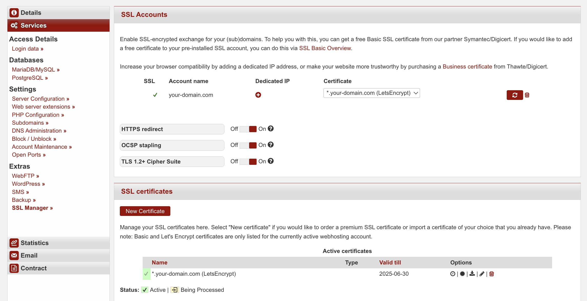

## 5. Configurarea PHP

1. În panoul de control Hetzner, accesați secțiunea "PHP Configuration"
2. Asigurați-vă că PHP 8.4 este selectat ca versiune
3. Ajustați orice alte setări PHP după cum este necesar pentru performanță optimă,
   deși cele implicite sunt în regulă

*Notă: Extensiile necesare: pdo, openssl și gettext sunt instalate implicit*

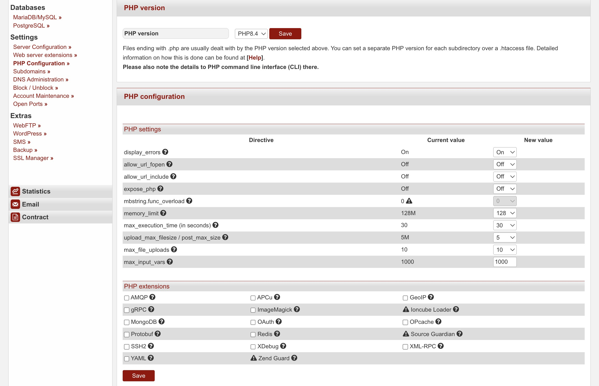

## 6. Crearea căii pentru deploy-uri automate cu WebFTP

1. Accesați interfața WebFTP din panoul de control Hetzner
2. Navigați la directorul public_html, care este directorul rădăcină al site-ului dvs. web

   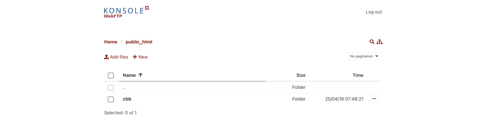

3. Creați un nou director numit `cbb`
4. În directorul `cbb`, creați un nou director numit `public`

Directorul `cbb` va fi ținta pentru deploy-urile prin GitHub Actions.

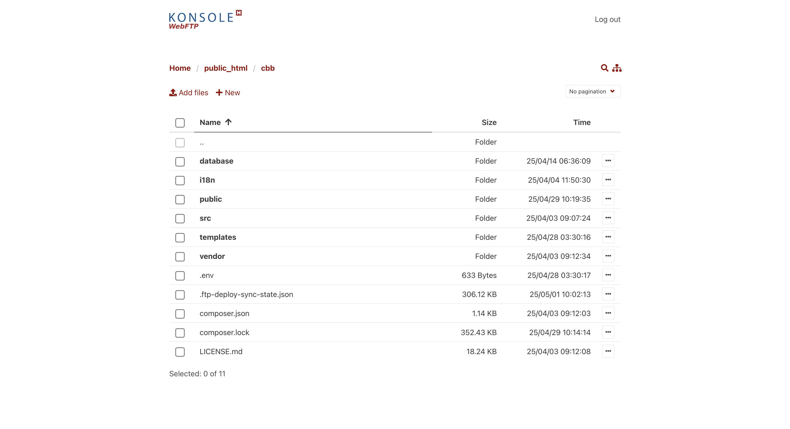

## 7. Setarea directorului rădăcină la `public_html/cbb/public`

1. În panoul de control Hetzner, accesați secțiunea "Server Configuration"
2. Clic pe `public_html/cbb/public`
3. Clic pe "Change document root"

## 8. Configurarea fișierului Apache .htaccess

1. Accesați "Server Configuration" și ar trebui să vedeți următoarele:

   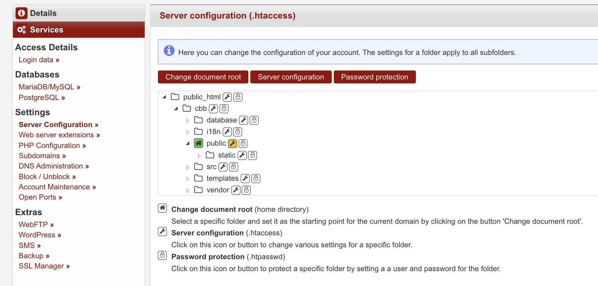
   
2. Apăsați pe imaginea 🔧(cheie fixă) și apoi "Advanced View"
3. Copiați și lipiți următoarele:

   ```apacheconf
   RewriteEngine On

   # redirecționează cererile pentru fișiere inexistente sau directorul static către index.php
   RewriteCond %{REQUEST_FILENAME} !-f
   RewriteCond %{REQUEST_URI} !^/static/ [NC]
   RewriteRule ^ index.php [L]
    
   # compresie gzip
   <IfModule mod_deflate.c>
     AddOutputFilterByType DEFLATE text/plain
     AddOutputFilterByType DEFLATE text/html
     AddOutputFilterByType DEFLATE text/xml
     AddOutputFilterByType DEFLATE text/css
     AddOutputFilterByType DEFLATE text/javascript
     AddOutputFilterByType DEFLATE application/xml
     AddOutputFilterByType DEFLATE application/xhtml+xml
     AddOutputFilterByType DEFLATE application/rss+xml
     AddOutputFilterByType DEFLATE application/javascript
     AddOutputFilterByType DEFLATE application/x-javascript
   </IfModule>
    
   # cache fișiere statice
   <IfModule mod_expires.c>
       ExpiresActive On
       ExpiresByType image/svg+xml "access plus 30 days"
       ExpiresByType text/css "access plus 1 day"
       ExpiresByType text/javascript "access plus 1 day"
       ExpiresByType application/javascript "access plus 1 day"
   </IfModule>
   ```

4. Apăsați salvare și reîncărcați pagina pentru a vă asigura că modificările au fost salvate (mai dă rateuri)

Puteți verifica dacă fișierul .htaccess este configurat corect vizitându-l în WebFTP:

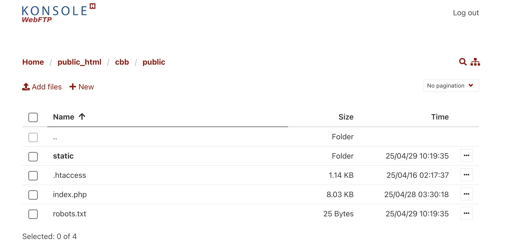

## 9. Configurarea secretelor și variabilelor GitHub

Acum vine munca de chinez bătrân: crearea tuturor secretelor și variabilelor necesare pe GitHub.

Pentru detaliile FTP, mergeți la "Access Details" în Hetzner:

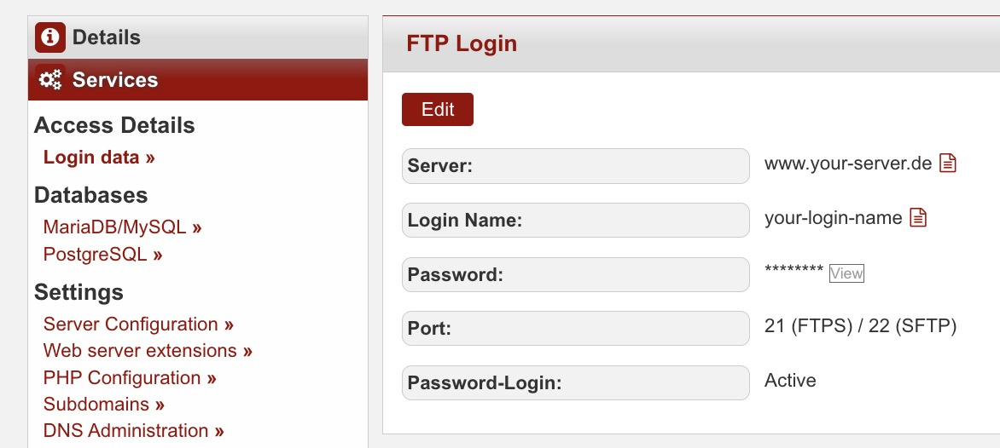

Pentru email, mergeți la "Email" > "Mailboxes" > "How to set up a mail program":

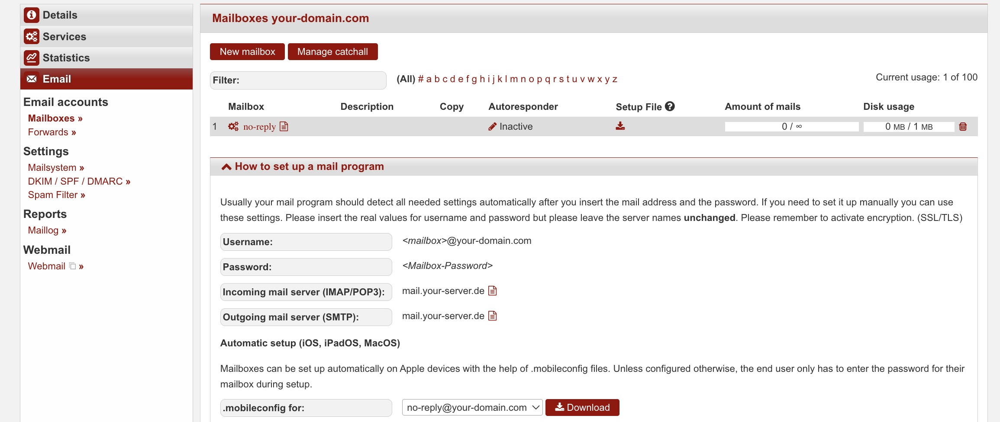

1. În repository-ul GitHub, navigați la secțiunea "Settings"
2. Faceți clic pe "Secrets and variables", și apoi pe "Actions"

   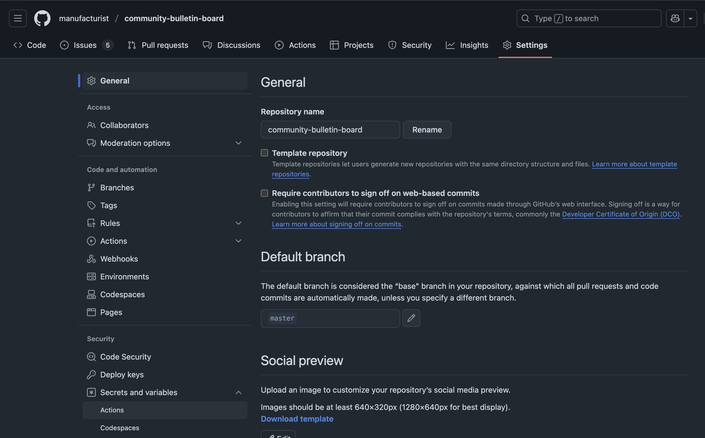

3. Va trebui să adăugați următoarele secrete / variabile în repository:

   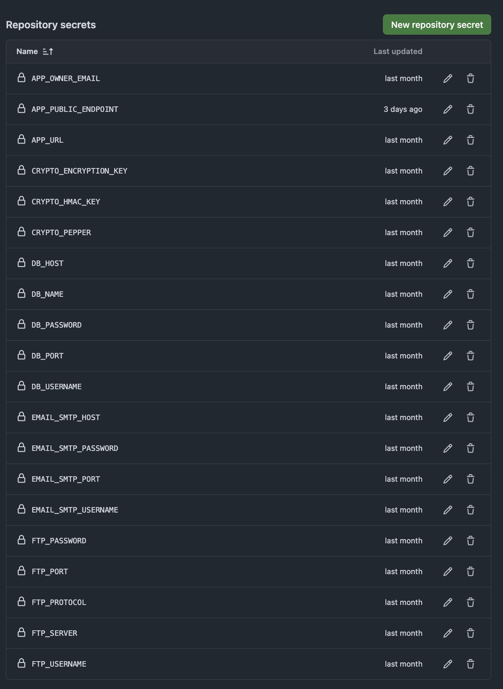

4. Odată ce acest lucru este făcut, accesați fila "Variables" și adăugați următoarele variabile:

   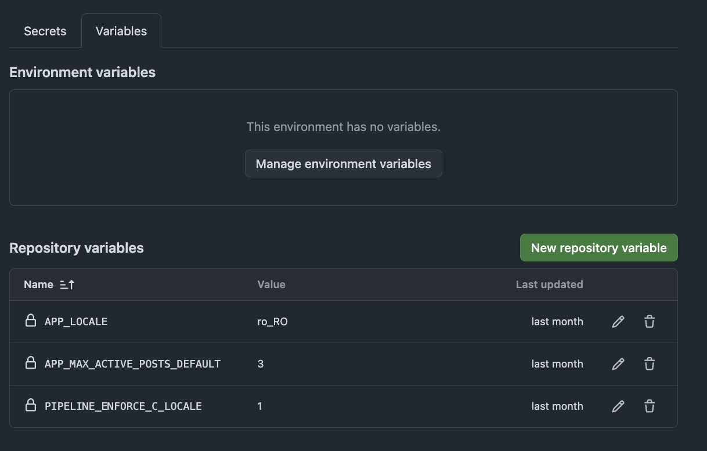

## 10. Deploy-ul soluției de pe GitHub

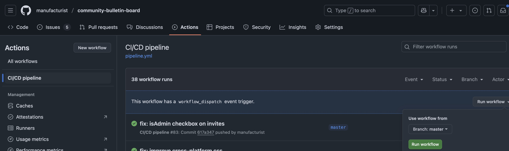

1. Accesați fila "Actions" și faceți clic pe workflow-ul "CI/CD pipeline"
2. Faceți clic pe dropdown-ul "Run workflow" și apoi pe butonul "Run workflow"
3. Așteptați finalizarea workflow-ului și apoi verificați dacă deploy-ul a fost realizat cu succes

Sper că acest ghid a funcționat pentru dvs. fără probleme. Dacă aveți întrebări sau aveți nevoie de
asistență suplimentară, nu ezitați să deschideți un "issue" pe GitHub.